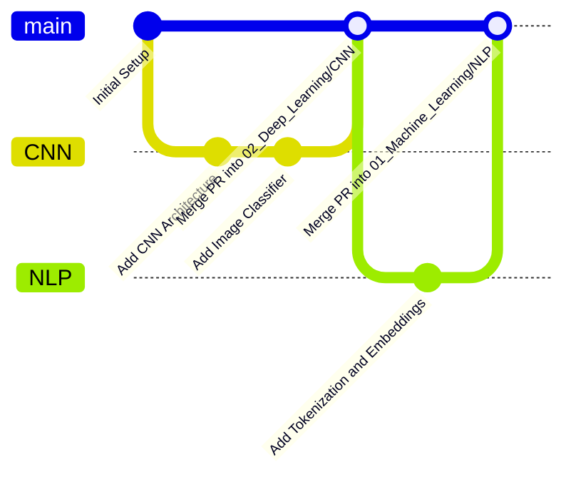

# 🌿 Git Branching & Workflow Guide

> **Learn_ML_DL** রিপোজিটরিতে নতুন কোনো টপিক বা প্রজেক্ট নিয়ে কাজ করার সময় কীভাবে আলাদা ব্রাঞ্চ তৈরি করতে হবে এবং কাজ শেষে কীভাবে মূল `main` ব্রাঞ্চে ফোল্ডার আকারে মার্জ করতে হবে তার স্ট্যান্ডার্ড গাইড।

---

## 🎯 মূল উদ্দেশ্য (Key Objectives)

- 🚀 **টপিক-ভিত্তিক ব্রাঞ্চিং**: যখন কোনো নির্দিষ্ট টপিক (যেমন **CNN**, **NLP**, **RNN**, **Transformers**) নিয়ে কাজ করবেন, তখন আলাদা একটি ব্রাঞ্চে কাজ করা।
- 📦 **ফোকাসড ওয়ার্কস্পেস**: ব্রাঞ্চটিতে শুধুমাত্র সেই টপিকের কোড ও নোটবুক তৈরি বা আপডেট করা।
- 🔗 **ক্লিন মার্জিং**: কাজ শেষে GitHub-এ Pull Request (PR) তৈরির মাধ্যমে ১ ক্লিকে `main` ব্রাঞ্চের নির্দিষ্ট ফোল্ডারে মার্জ করা।

---
git subtree push --prefix=02_Deep_Learning/CNN origin CNN
## 🔄 সম্পূর্ণ ওয়ার্কফ্লো চিত্র (Workflow Diagram)



---

## 🛠️ ধাপে ধাপে নির্দেশিকা (Step-by-Step Guide)

### 🔹 ধাপ ১: `main` ব্রাঞ্চ থেকে নতুন ব্রাঞ্চ তৈরি করুন

সর্বদা `main` ব্রাঞ্চের লেটেস্ট কোড পুল করে নিয়ে নতুন ফিচার ব্রাঞ্চ খুলবেন:

```bash
# ১. main ব্রাঞ্চে সুইচ করুন
git checkout main

# ২. রিমোট থেকে লেটেস্ট আপডেট নামিয়ে নিন
git pull origin main

# ৩. নতুন ব্রাঞ্চ তৈরি করে তাতে সুইচ করুন (উদাহরণ: CNN)
git checkout -b CNN
```

---

### 🔹 ধাপ ২: নির্দিষ্ট ফোল্ডারে কোড ও নোটবুক তৈরি করুন

আপনি যে টপিকের ব্রাঞ্চে আছেন, শুধুমাত্র সেই ফোল্ডারের ভেতরে আপনার ফাইলগুলো রাখুন:

| আপনার ব্রাঞ্চের নাম | যে ফোল্ডারে কাজ করবেন | ফাইলের উদাহরণ |
|---|---|---|
| `CNN` | `02_Deep_Learning/CNN/` | `cnn_model.py`, `image_classifier.ipynb` |
| `NLP` | `01_Machine_Learning/nlp/` | `text_classification.ipynb`, `embeddings.py` |
| `feature/clustering` | `01_Machine_Learning/100_days_of_ml/` | `dbscan_clustering.ipynb` |

> [!NOTE]
> অন্য কোনো ফোল্ডারের ফাইল অপ্রয়োজনে এডিট বা মুভ করবেন না। এতে ভবিষ্যতে মার্জ করার সময় কোনো মার্জ কনফ্লিক্ট তৈরি হবে না।

---

### 🔹 ধাপ ৩: পরিবর্তন স্টেজ, কমিট ও পুশ করুন

কাজ শেষ হলে আপনার ব্রাঞ্চে পরিবর্তনগুলো গিটহাবে পুশ করুন:

```bash
# ১. নির্দিষ্ট ফোল্ডারের পরিবর্তনগুলো স্টেজ করুন
git add 02_Deep_Learning/CNN/

# ২. অর্থপূর্ণ কমিট মেসেজ দিন
git commit -m "feat(cnn): add CNN model architecture and classification notebook"

# ৩. গিটহাবে ব্রাঞ্চটি পুশ করুন
git push -u origin CNN
```

---

### 🔹 ধাপ ৪: GitHub-এ Pull Request (PR) ও Merge করুন

1. আপনার ব্রাউজারে [SOURAVcse9/Learn_ML_DL](https://github.com/SOURAVcse9/Learn_ML_DL) রিপোজিটরিতে যান।
2. উপরে সবুজ **`Compare & pull request`** বাটন দেখতে পাবেন।
3. বাটনে ক্লিক করে **`Create pull request`** চাপুন।
4. এরপর **`Merge pull request`** ➡️ **`Confirm merge`** করুন।

> [!TIP]
> যেহেতু ব্রাঞ্চটি সরাসরি `main` থেকে তৈরি করা হয়েছে, তাই কোনো হিস্ট্রি এরর (`different commit histories`) আসবে না এবং স্বয়ংক্রিয়ভাবে `Able to merge` দেখাবে।

---

### 🔹 ধাপ ৫: লোকাল `main` ব্রাঞ্চ আপডেট করুন

গিটহাবে মার্জ সম্পন্ন হওয়ার পর আপনার লোকাল পিসির `main` ব্রাঞ্চ আপডেট করে নিন:

```bash
# ১. main ব্রাঞ্চে ফিরে আসুন
git checkout main

# ২. গিটহাবে মার্জ হওয়া নতুন কোড নামিয়ে নিন
git pull origin main

# ৩. কাজ শেষ হয়ে গেলে লোকাল ফিচার ব্রাঞ্চটি ডিলিট করতে পারেন (অপশনাল)
git branch -d CNN
```

---

## ⚡ কুইক চিটশিট (Quick Command Cheat-Sheet)

```bash
# ব্রাঞ্চ লিস্ট দেখতে
git branch -a

# নতুন ব্রাঞ্চ খুলতে
git checkout -b <branch_name>

# অন্য ব্রাঞ্চে যেতে
git checkout <branch_name>

# বর্তমান ফাইলের স্ট্যাটাস চেক করতে
git status

# রিমোট থেকে কোনো পুরনো ব্রাঞ্চ ডিলিট করতে
git push origin --delete <branch_name>
```

---
